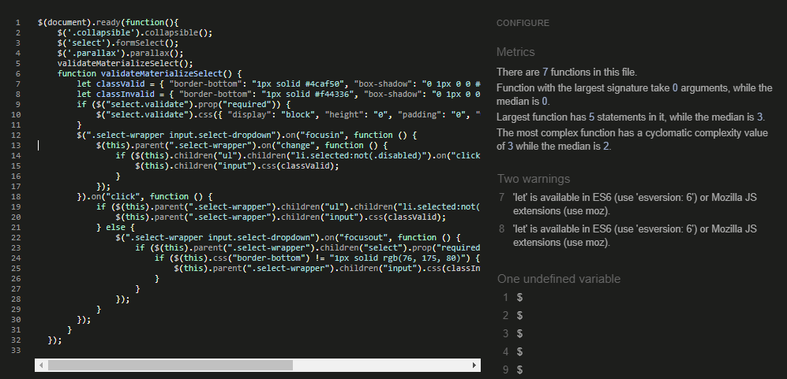

## Testing ##

- All the features of this project have been manually tested  in order to make sure they respond effectively. Moreover, users can move from page to page since all of them are interconnected. 

As part of the testing process this website was tested using:
 - [W3C Markup Validator](https://validator.w3.org/) 
 - [Jigsaw W3C CSS Validator](https://jigsaw.w3.org/css-validator/)
- [Jshint](https://jshint.com/)
## W3C Markup Validator

- ## Base page ##

- ## Home page ##

- ## Add and Edit a cocktail pages ##

- ## Log in and Register  pages ##

- ## Profile page ##

## W3C CSS Validator

## Js hint Validator

 This web has been tested in desktop devices using the following browser:

 - [Mozila fire fox](https://www.mozilla.org/en-US/firefox/new/)
 - [Opera](https://www.opera.com/)
 - [Chrome](https://www.google.com/chrome/)
 - [windows Explorer](https://www.microsoft.com/en-us/edge).

 In all these browsers the apparience, images and responsiveness worked perfectly. 

 

 ## Responsiveness ##

 This website is responsive since it was built using the front-end template "Heroic Features"  from Start Bootstrap. A Bootstrap home page template featuring a hero unit and a grid of thumbnail features
 Consequently, it has been developed to  be displayed on any device. 

As illustrated in the image below, this website has been tested in all devices  available in the Google chrome Developer tool. The results are the followings:

## Bugs ##

### Bug 1. ###
- Following the suggestion given in one of the videos, the ingredients section in mongodb was set in array. However, when the user tryed to add ingredients there were a group of characters which changed the text in this section. Therefore. I changed this option to string and the problem desappeard 

### Bug 2. ###
- 

### Bug 3. ###
- 

## Testing users' stories ##
### As a user I want to:
- **Have access to all recipes displayed in the website**
  - Any visitor of the website  have access to all the recipes posted on the site.

- **See the ingredients and preparation of the cocktails**
  - when clicking on any of the recipes the user will be display all the information regarding that cocktail. 
- **Find easily the different recipes**
  - In order to help the user to find the cocktails easily, the recipes are clasified and displayed to the user by the different alcohol categories they belong to. Also the site has a search-bar that makes the process of finding cocktails  easier. 
- **Add my own recipes** 
  - When a user registers in the site has the posibility of adding  new recipes to the page.
- **Edit my own recipes** 
  -  The user also has  the chance to edit and erase only those recipes that he/she added 
- **Delete my own recipes if needed** 
  - From their profile page the users can find a button to erase the recipes added by themselves
- **To move easly and intuitively**
  - All pages of the site are interconnected. Therefore, users can move around the different section of the site through the menu buttons. 
- **Register and login to have my personalized profile.** 
  - In order to manage the cocktail recipes only registered user can find a profile page where he/she can administrate their own cocktails.  

  
  
 