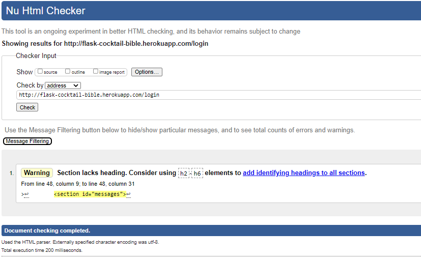
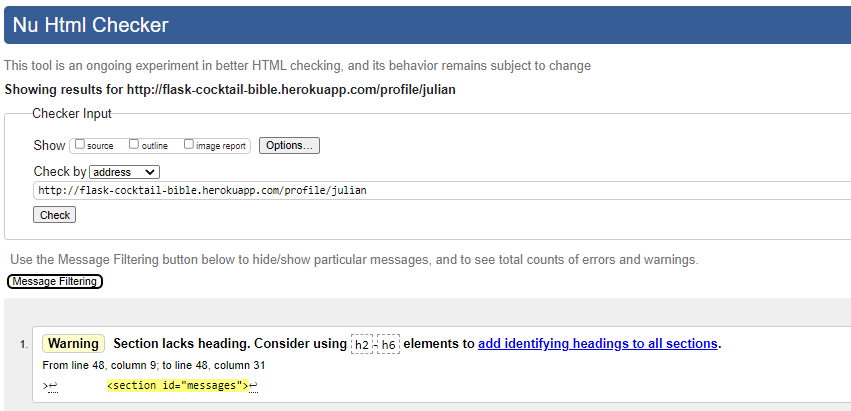

## Testing ##

- All the features of this project have been manually tested  in order to make sure they respond effectively. Moreover, users can move from page to page since all of them are interconnected. 

As part of the testing process, this website was tested using:
 - [W3C Markup Validator](https://validator.w3.org/) 
 - [Jigsaw W3C CSS Validator](https://jigsaw.w3.org/css-validator/)
- [Jshint](https://jshint.com/)
## W3C Markup Validator

- ## Add and Edit a cocktail pages ##

- ## Log in and Register  pages ##

- ## Profile page ##

## W3C CSS Validator

## Js hint Validator

## pep8 Python Validator

 This web has been tested in desktop devices using the following browser:

 - [Mozila fire fox](https://www.mozilla.org/en-US/firefox/new/)
 - [Opera](https://www.opera.com/)
 - [Chrome](https://www.google.com/chrome/)
 - [Windows Explorer](https://www.microsoft.com/en-us/edge).

 In all these browsers the appearance, images and responsiveness worked perfectly. 

 

 ## Responsiveness ##

 This website is responsive since it was built using the front-end template "Heroic Features"  from Start Bootstrap. A Bootstrap home page template featuring a hero unit and a grid of thumbnail features
 Consequently, it has been developed to  be displayed on any device. 

As illustrated in the image below, this website has been tested in all devices  available in the Google chrome Developer tool. The results are the followings:

## Bugs ##

### Bug 1. ###
- Following the suggestion given in one of the videos, the ingredients' section in mongodb was set in array. However, when the user tried to add ingredients, there were a group of characters which changed the text in this section. Therefore. I changed this option to string and the problem disappeared 

### Bug 2. ###
- It was not possible to set the modal window in the profile page, as it was the first idea. When trying to do so, the modal window deleted a different cocktail and not the one I wanted. Therefore, I had to place in the edit page. Next to the cancel and save button.  
### Bug 3. ###
- when i closed my session in git pop and tried to open my workspace to keep working on my project the env.py file disappeared, i  could not keep working. After a long investigation i discovered that every time you want to access your project, once it has been closed, you need to create again this env.py . The content of this file is :

- Import os
os.environ.setdefault("IP", "Added by developer")
os.environ.setdefault("PORT", "Added by developer")
os.environ.setdefault("SECRET_KEY", "Added by developer")
os.environ.setdefault("MONGO_URI", "Added by developer")
os.environ.setdefault("MONGO_DBNAME", "Added by developer")

and the information required to connect to Heroku can be found in your Heroku project. To access this informs you just need to go to setting and click on the "Config Vars button". There you can find  information required in your env.py file. 
Finally, once you had completed the env.py file, you need to type in your terminal window : pip3 freeze -- local > requirements.txt. (The file is needed for Heroku to know which filed to install.)

Once it is done you can keep working on your project. 

(You have to do it every time you open your workspace.)

## Testing users' stories ##
### As a user, I want to:
- **Have access to all recipes displayed on the website**
  - Any visitor of the website  have access to all the recipes posted on the site.

- **See the ingredients and preparation of the cocktails**
  - when clicking on any of the recipes, the user will be display all the information regarding that cocktail. 
- **Find easily the different recipes**
  - In order to help the user to find the cocktails easily, the recipes are classified and displayed to the user by the different alcohol categories they belong to. Also the site has a search-bar that makes the process of finding cocktails  easier. 
- **Add my own recipes** 
  - When a user registers in, the site has the possibility of adding  new recipes to the page.
- **Edit my own recipes** 
  -  The user also has  the chance to edit and erase only those recipes that he/she added 
- **Delete my own recipes if needed** 
  - From their profile page, the users can find a button to erase the recipes added by themselves
- **To move easily and intuitively**
  - All pages of the site are interconnected. Therefore, users can move around the different section of the site through the menu buttons. 
  
- **Register and login to have my personalized profile.** 
  - In order to manage the cocktail recipes, only registered user can find a profile page where he/she can administrate their own cocktails.  

  
  
 